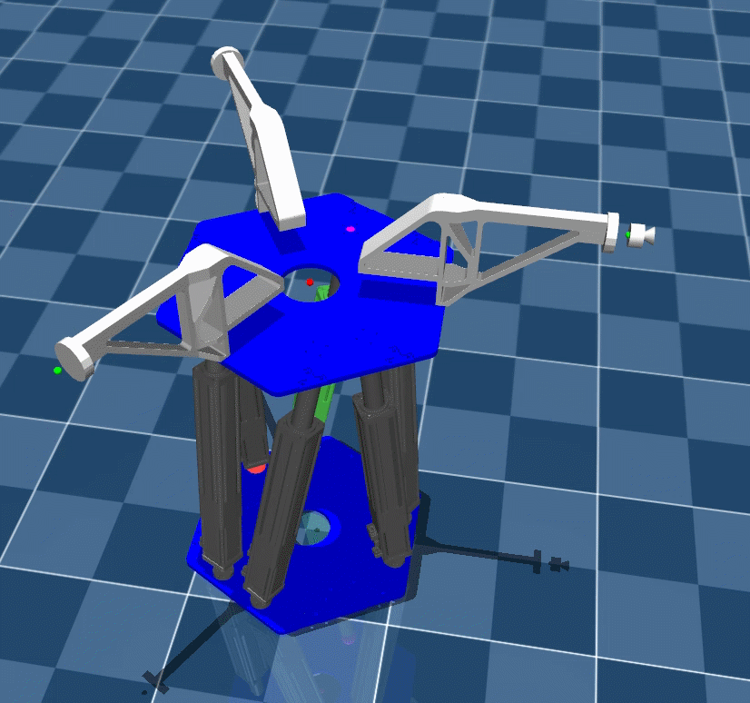

# Stewart 并联平台柔顺对接仿真

基于 MuJoCo 搭建的 6-DOF Stewart 并联平台仿真与控制项目，面向精密装配中的柔顺对接任务。项目打通了“六维力感知—状态机调度—导纳控制—运动学解算—支腿执行”的闭环，并对传感器处理、机构可达性与异常状态进行了工程化封装。

> 当前主程序采用“积分导纳 + 状态机”完成恒力对接；仓库中同时保留了传统导纳、分数阶导纳和自适应导纳速度控制器，用于后续算法对比与真机迁移。

## 仿真演示

<p align="center">
  
</p>

<p align="center">Stewart 并联平台柔顺对接与姿态调整仿真</p>

## 控制流程


状态机按照以下顺序组织对接任务：

```text
CALIBRATING → REACHING → CONTACT → FORCE_CONTROL → FINISHED
                         └─ 目标不可达 → FAULT
```

- `CALIBRATING`：保持初始位姿并持续估计六维力传感器零偏。
- `REACHING`：平滑建立期望轴向力，检测接触事件。
- `CONTACT`：缩短力建立时间，使系统由接近阶段过渡到恒力控制。
- `FORCE_CONTROL`：持续执行六维导纳控制；力/力矩在设定容差内稳定一段时间后判定完成。
- `FAULT`：当支腿行程或球铰偏转超出约束时进入故障状态。

## 主要功能

### 1. Stewart 运动学与约束检查

- 实现平台/工具坐标系之间的位姿转换、Stewart 逆运动学与数值正运动学。
- 将末端目标位姿转换为六条支腿长度及滑台控制量。
- 在下发控制量前检查支腿行程、上下球铰偏转角和目标位姿可达性，避免无效目标继续进入执行层。

### 2. 六维力信号处理

- 从 MuJoCo `force/torque sensor` 读取六维力和力矩。
- 根据末端负载质量与质心位置进行重力补偿。
- 完成传感器坐标系到工具坐标系的力旋量变换，并补偿测量点偏置产生的附加力矩。
- 支持启动零偏标定和一阶在线低通滤波。

### 3. 积分导纳与恒力对接

主循环采用六维积分导纳模型：

```text
M·ẍ + D·ẋ + K·(x − x_d) = (F_ext − F_d) + K_i ∫(F_ext − F_d)dt
```

积分项用于消除小幅稳态力/力矩残差，并通过积分限幅与泄漏因子抑制 windup 和历史误差累积。控制器输出工具坐标系下的增量位姿，再依据实时工具姿态映射到世界坐标系，避免姿态变化时重复旋转历史轨迹。

### 4. 多种柔顺控制算法储备

仓库还包含以下独立算法模块：

- 传统六维导纳控制；
- 带积分补偿的导纳控制；
- 基于 Grünwald–Letnikov 离散形式的分数阶导纳控制；
- 面向速度接口的自适应导纳控制，包含力误差微分滤波、复合误差、自适应参数更新、泄漏项和多级限幅。

其中，自适应导纳模块当前作为算法实验代码保留，尚未接入 `main.py` 的默认控制链路。

## 当前仿真参数

| 参数 | 默认值 | 说明 |
|---|---:|---|
| 仿真/控制周期 | 1 ms | MuJoCo `timestep = 0.001` |
| 轴向目标力 | -10 N | 工具坐标系 Z 轴 |
| 接触阈值 | 1 N | 触发 `REACHING → CONTACT` |
| 力传感器滤波截止频率 | 30 Hz | 一阶低通滤波 |
| 接近阶段力斜坡 | 1.0 s | 平滑建立接触力 |
| 接触阶段力斜坡 | 0.1 s | 快速过渡到目标力 |
| 完成判据 | ±0.3 N、±0.02 N·m，持续 1 s | 六维力/力矩全部满足容差 |

以上为当前代码中的仿真配置，不等同于真机性能指标。

## 代码结构

| 文件/目录 | 作用 |
|---|---|
| `main.py` | 仿真入口、状态调度与完整闭环控制 |
| `scene.xml` / `stewart_new.xml` | MuJoCo 场景、平台机构、执行器与传感器模型 |
| `src/stewartt_State.py` | 与仿真器解耦的任务状态机 |
| `src/IKFK.py` | 正/逆运动学、坐标转换及可达性检查 |
| `src/mujoco_ft_sensor.py` | 六维力读取、重力补偿、坐标变换、零偏和滤波 |
| `src/mujoco_stewart_platform.py` | 六支腿关节与执行器控制封装 |
| `src/admi_integral.py` | 当前主循环使用的积分导纳控制器 |
| `src/admi.py` | 传统导纳控制器 |
| `src/admi_fractional.py` | 分数阶导纳控制器 |
| `src/adaptive_admit.py` | 自适应导纳速度控制器 |
| `src/traj.py` | 笛卡尔空间五次多项式轨迹规划 |
| `src/data_logger.py` / `src/matplot.py` | 数据记录与实时可视化工具 |
| `stewart/` | MATLAB/Simulink 算法分析与对比文件 |

## 运行方式

建议使用 Python 3.10 或以上版本。

```bash
pip install mujoco numpy glfw
python main.py
```

如需使用实时曲线、键盘交互等辅助工具，可额外安装：

```bash
pip install pyqtgraph PyQt5 pynput
```

> 仓库目前尚未提供完整的 `requirements.txt` 或 `pyproject.toml`。建议后续补充依赖锁定，以便复现实验环境。

## 后续计划

- 将自适应导纳速度控制器接入统一主循环，并与传统/积分/分数阶导纳进行对照实验；
- 补充阶跃力响应、接触峰值、稳态误差和调整时间等量化曲线；
- 增加参数配置文件、单元测试和批量仿真脚本；
- 抽象 MuJoCo 与真机执行层接口，支持控制算法从仿真迁移到 EtherCAT 运动控制平台。

## 说明

本仓库用于机器人柔顺控制与精密装配研究。涉及真机测试时，应重新标定坐标系、机构约束、传感器方向和安全限位，禁止直接沿用仿真参数。
